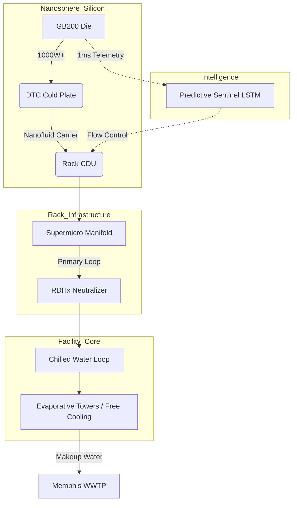

# xai-colossus-cooling

> **Hyperscale AI Thermal Management — APEX Bio-Inspired Architecture**

---

## 🛑 The Challenge: The 1.5 Gigawatt Thermal Wall

Colossus 2 is the world's first **1.5 GW coherent AI training cluster**, utilizing over 555,000 NVIDIA GB200/GB300 Blackwell GPUs. At this density, conventional data center cooling completely breaks down:
- **Heat Flux:** Modern dies dissipate 1,000W+; rack densities exceed **120 kW/rack**.
- **PUE Inefficiency:** Traditional air cooling at this scale yields a Power Usage Effectiveness (PUE) of 1.4–1.6, wasting up to 600 MW on cooling alone.
- **Water Consumption:** Cooling towers for 1.5 GW evaporate millions of gallons per day, threatening the Memphis aquifer.
- **Latency Cascades:** Reactive thermal throttling ruins massive parallel training runs (AllReduce bottlenecks).

---

## 🧬 The Solution: APEX Bio-Inspired Architecture

This repository contains the blueprints, logic, and telemetry controllers for a cooling stack inspired by biological thermoregulation (vascular networks, mammalian evaporative cooling, and thermite ant colony heat management).

### 1. Chip-Level: Direct-to-Chip (DTC) Nanofluids
- **Cold Plates:** Supermicro custom manifolds bonded directly to the CoWoS-L substrate.
- **Nanosphere Carriers:** 3M Novec infused with 1–5% Graphene/Al₂O₃ nanoparticles.
- **Result:** Captures **92% of chip TDP** at the source, preventing room-level heat bleed.

### 2. Rack-Level: Rear-Door Heat Exchangers (RDHx)
- Liquid-cooled rear doors neutralize the remaining 8% of radiant rack heat.
- **Zero Air Aisle:** Eliminates hot-aisle/cold-aisle geometry, unlocking ultra-dense NVL72 rack spacing.

### 3. Facility-Level: Predictive Thermal Sentinel
- **LSTM Neural Network:** Ingests 1ms silicon-level telemetry from `xai-colossus-nanosphere`.
- **Pre-emptive Pumping:** Predicts GPU thermal throttling **8–12 minutes before it occurs** and pre-emptively ramps CDUs (Coolant Distribution Units).

### 4. Site-Level: Water Reclamation Loop
- Interfaces directly with `xai-colossus-waterplant`. Uses reclaimed Memphis WWTP water for tower makeup, ensuring **0 GPD** net draw from the local drinking aquifer.

---

## 🗺️ System Topology

---

## 📊 Engineering Impact

| Metric | Industry Baseline | APEX Architecture |
|--------|-------------------|-------------------|
| **PUE** | 1.45–1.60 | **1.15–1.21** |
| **Rack Density** | 40–60 kW | **120 kW+** |
| **Aquifer Draw** | 4.5M GPD | **0 GPD (Reclaimed)** |
| **Thermal Throttling** | Reactive (High impact) | **-23% (Predictive)** |

---

## 🔐 About This Repository

This repo contains the internal configuration logic, fluid dynamics modeling (CFD), and control schemas for the Colossus 2 cooling loops. 

Part of the [GlacierEQ xAI Engineering Suite](https://github.com/GlacierEQ/xai-colossus-community).  
*Engineering at the limits of physics.*
