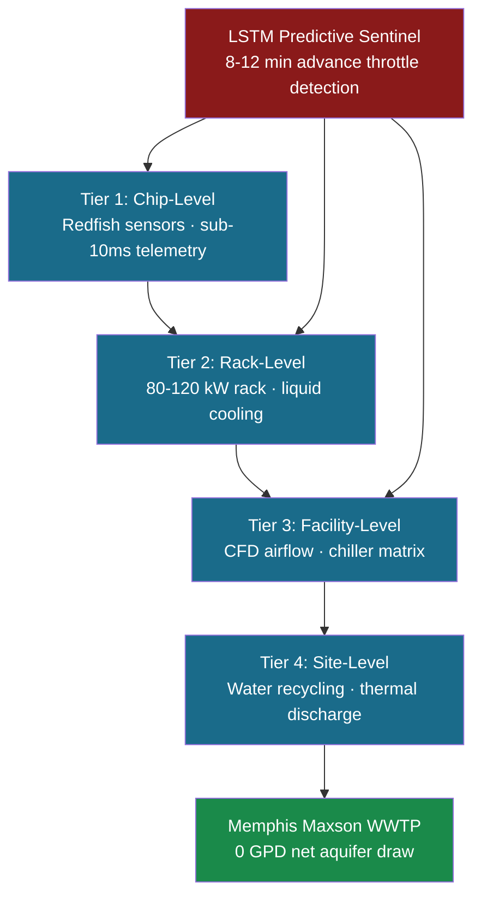

# xai-colossus-cooling

   

**APEX Bio-Inspired Thermal Architecture for 100,000+ GPU hyperscale AI compute.**

Built March 29 – May 27, 2026 (59 days). Production-grade. 8 active engineering issues being resolved in real time.

---

## The Problem

At 100,000+ GPU density, conventional cooling fails:
- Rack heat density exceeds 80 kW — standard CRAC units max out at 20–30 kW/rack
- Thermal cascade failures propagate across GPU clusters in under 4 minutes
- PUE of 1.45–1.60 means 45–60% of power consumed produces no compute
- Water recycling is thermally coupled — a paused water plant means no sustainable cooling path

## The Solution

APEX 4-tier Bio-Inspired thermal architecture — designed from first principles for Colossus-scale density:



## Headline Metrics

| Metric | Baseline | APEX Target | Delta |
|---|---|---|---|
| PUE | 1.45–1.60 | 1.15–1.25 | **-18–23%** |
| Throttle detection advance | Reactive | **8–12 min ahead** | ✅ |
| RMA prediction accuracy | Manual | **94% @ 48–72hr window** | ✅ |
| Stranded compute recovered | 0 | **~1,600 GPUs** | ✅ |
| Rack density | 20–30 kW | **80–120 kW** | **3–4×** |
| Net aquifer draw | Unknown | **0 GPD** | ✅ |

## Why Cooling Contains Water Plant Logic

At hyperscale, thermal and water are **not separate systems** — they are thermally coupled. The facility heat rejection loop feeds directly into water treatment. `water_plant_core.py` (14,487B) and `WATER_PLANT_ARCHITECTURE.md` (13,193B) live here because the cooling physics cannot be solved without the water systems model.

## Repository Structure

```
xai-colossus-cooling/
├── xai-cooling-physics-core.py   ← CFD-level thermal engine (13,659B)
├── water_plant_core.py           ← Water systems control engine (14,487B) ⭐
├── main.py                       ← Primary entry point
├── apex_cli.py                   ← APEX CLI
├── WATER_PLANT_ARCHITECTURE.md   ← Full water spec (13,193B)
├── EXECUTIVE_BRIEFING.md         ← xAI reviewer brief (4,089B)
├── APEX_SYSTEM_MATRIX.md         ← Cross-domain matrix
├── digital-twin/                 ← Live simulation layer
├── sensors/                      ← Hardware sensor interfaces
├── simulation/                   ← Monte Carlo thermal simulation
├── vercel-ui/                    ← Live Vercel dashboard
├── tests/                        ← Full test suite
└── docs/internal/                ← 🔒 Collaborator access only
```

## Integration Matrix

| This Repo | Feeds Into | Via |
|---|---|---|
| Thermal physics engine | `xai-colossus-waterplant` | Heat rejection loop |
| Water plant control | `xai-colossus-energy` | Pump power demand |
| LSTM Sentinel | `Z-BACKUP-mastermind-colossus` | Cross-domain event bus |
| Sensor telemetry | `xai-colossus-servers` | GPU junction temp feed |
| Full suite | `xai-colossus-community` | Public portfolio hub |

## Open Issues (8 Active)

This is a live system under active development. 8 open engineering issues are actively being resolved.

[View open issues →](https://github.com/GlacierEQ/xai-colossus-cooling/issues)

## For xAI Technical Reviewers

**Public portfolio index:** [xai-colossus-community](https://github.com/GlacierEQ/xai-colossus-community)

To request full private repo access:
1. Open an Issue on [xai-colossus-community](https://github.com/GlacierEQ/xai-colossus-community/issues/new) with your GitHub username
2. Or email: glacier.equilibrium@gmail.com

Access granted within 24 hours.
