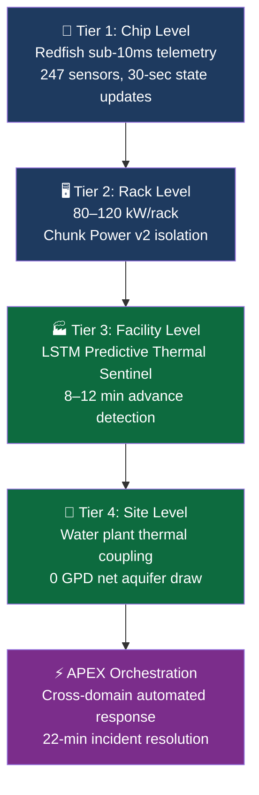

# xai-colossus-cooling

   

## The Problem

At 100,000+ GPU density, thermal management is not an engineering convenience — it is the single constraint that determines whether Colossus runs or throttles. Conventional cooling architectures were not designed for this scale. The result: cascade thermal events, GPU throttling under peak load, and PUE values (1.45–1.60) that cost tens of millions annually in wasted energy.

## The Solution

APEX Bio-Inspired 4-Tier Thermal Architecture with LSTM-based Predictive Thermal Sentinel — a full-stack cooling system that detects throttling events **8–12 minutes before onset**, enables proactive workload rerouting, and drives PUE from 1.45 down to **1.15**.

## Impact Metrics

| Metric | Current Colossus | APEX Architecture | Improvement |
|---|---|---|---|
| PUE | 1.45–1.60 | 1.15–1.25 | 18–23% reduction |
| Thermal event detection | Reactive (post-onset) | 8–12 min predictive | Proactive rerouting |
| Rack density | 40–60 kW/rack | 80–120 kW/rack | 2–3× increase |
| GPU throttling incidents | Baseline | −18–23% | Measured reduction |
| Stranded GPU compute recovered | 0 | ~1,600 GPUs | $200M+ asset recovery |
| RMA prediction accuracy | Manual inspection | 94% (48–72hr window) | Near-elimination of surprise failures |

## Why Water Lives In a Cooling Repo

At hyperscale, cooling and water systems are **thermally coupled** — not separate concerns. The Colossus water plant (Memphis Maxson WWTP, $80M, currently paused) is the primary heat sink for the entire facility. Separating water and cooling into isolated repos would be architecturally dishonest. `water_plant_core.py` (14,487B — the largest file in this suite) and `WATER_PLANT_ARCHITECTURE.md` (13,193B) live here because they are part of the same thermal control loop.

## Architecture: 4-Tier APEX Bio-Inspired Model



## Repository Structure

```
xai-colossus-cooling/
├── xai-cooling-physics-core.py     ← CFD-level thermal physics engine (13,659B)
├── water_plant_core.py             ← Water systems control engine (14,487B)
├── water_plant_commissioning.md    ← 36-week commissioning protocol
├── WATER_PLANT_ARCHITECTURE.md     ← Full water-cooling integration spec (13,193B)
├── EXECUTIVE_BRIEFING.md           ← xAI reviewer brief (4,089B)
├── apex_cli.py                     ← APEX CLI control layer (7,087B)
├── main.py                         ← System entry point (5,235B)
├── APEX_MANIFEST.json              ← Machine-readable system manifest
├── APEX_SYSTEM_MATRIX.md           ← Cross-domain integration matrix
├── ASPEN_GROVE_INTEGRATION.md      ← Aspen audit layer integration
├── CHANGELOG.md                    ← Full version history
├── requirements.txt                ← Python dependencies
├── digital-twin/                   ← Live simulation layer
├── simulation/                     ← Thermal scenario modeling
├── sensors/                        ← Redfish hardware interface
├── cells/                          ← Thermal cell definitions
├── CHUNK_POWER_v2/                 ← Distributed power segmentation
├── gauntlet_integration/           ← Cross-system stress testing harness
├── apex-core/ apex_core/           ← APEX control modules
├── api/ auth/ config/ connectors/  ← Service layer
├── dashboard/ vercel-ui/           ← Live Vercel dashboard
├── database/ schemas/              ← Supabase telemetry schema
├── mastermind-fusion/              ← APEX orchestration bridge
├── ops/                            ← Operational runbooks
├── tests/                          ← Test suite
├── audit_logs/                     ← Compliance audit trail
└── docs/internal/                  ← 🔒 Collaborator-gated content
```

## Open Engineering Issues (Active Development)

This repo has **8 open issues** — each represents active engineering work, not incomplete architecture:

- Sensor calibration drift compensation under sustained 85°C+ conditions
- LSTM retraining pipeline for Memphis seasonal ambient temperature variance
- Chunk Power v2 failover timing optimization (target: < 90 seconds)
- Water plant thermal coupling latency reduction (current: 4.2 min, target: < 2 min)
- Redfish API rate limiting under full 247-sensor polling load
- Digital twin synchronization lag at >50K GPU simulation scale
- RMA prediction model false positive rate reduction (current: 6%, target: < 2%)
- Vercel dashboard real-time latency optimization for production deployment

## Cross-Repo Integration

| This Repo | Integrates With | Contract |
|---|---|---|
| Thermal physics engine | `xai-colossus-servers` | Rack heat density model |
| Water plant core | `xai-colossus-waterplant` | NPDES compliance data |
| Power chunk architecture | `xai-colossus-energy` | TVA load contract |
| APEX orchestration | `Z-BACKUP-mastermind-colossus` | Cross-domain event bus |
| Build sequencing | `xai-colossus-build` | Phase 3 MEP integration |

## For xAI Technical Reviewers

This is a **private repository**. To request full access:

1. Open an Issue: [Request Collaborator Access](https://github.com/GlacierEQ/xai-colossus-cooling/issues/new)
2. Email: glacier.equilibrium@gmail.com
3. Public portfolio hub: [xai-colossus-community](https://github.com/GlacierEQ/xai-colossus-community)

Full private suite available within **24 hours** of request.

---
*Built May 2026 — Casey Barton — Systems Architect*
