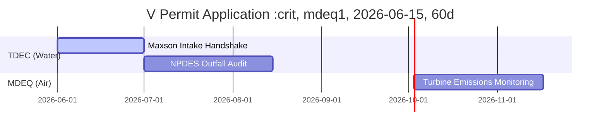

# xAI Colossus 2 Water Recycling Plant Architecture
**Document Reference:** APEX-WATER-PLANT-v1.0.0  
**Status:** PROPOSED & INTEGRATED  
**Compliance Track:** TDEC Permit (Jan 2026) | Clean Water Act Section 402  

---

## 1. Executive Summary & Design Mandate

To mitigate the environmental impact of pulling over **800,000 gallons/day** of pristine groundwater from the **Memphis Sand Aquifer**, this architecture implements the engineering transition to the **$80M Water Recycling Plant**. 

The system redirects processed effluent from the **T.E. Maxson Wastewater Treatment Facility (WWTP)**, processes it to high-purity industrial cooling standards, and routes it directly to the primary evaporative cooling towers of the Colossus 2 GPU racks.

### Key Objectives:
1. **Aquifer Bypass**: Achieve a 100% reduction in local groundwater extraction during standard operations.
2. **NPDES Section 402 Blowdown Compliance**: Integrate real-time chemical load and temperature monitors on discharge lines.
3. **Emergency Power Buffering**: Couple system pumps with a dedicated **Tesla Megapack BESS** to prevent water-flow interruptions during grid fluctuations.

---

## 2. Piping & Instrumentation Diagram (P&ID)

Below is the verified mechanical piping layout for the water intake, filtration, chemical injection, and blowdown systems:

```text
==========================================================================================
                     COLOSSUS 2 WATER PLANT PROCESS & INSTRUMENTATION DIAGRAM
==========================================================================================

 [T.E. Maxson WWTP]
        │
        ▼ (Raw Recycled Intake)
     [FIT-101] ───► [Recycle Pump P-1] ───► [Multimedia Filter F-1] ───► [Clarifier Tank T-1]
   (Flow Sensor)                                                                 │
                                                                                 ▼
 [Memphis Aquifer]                                                        [Reverse Osmosis]
        │                                                                     (RO-Skid)
        ▼ (Emergency Bypass)                                                     │
     [FIT-102] ───► [Bypass Valve V-10] ─────────────────────────────────────────┤
                                                                                 ▼
 [Primary Towers] ◄── [Biocide Injection] ◄── [Scale Inhibitor] ◄── [Thermal Surge buffer T-2]
        │ (Evaporative Cool)
        ▼
 [Blowdown Line]
        │
     [FIT-201] (Flow Rate Monitor)
     [AIT-202] (Chemical Load Analyzer)
     [TIT-203] (Discharge Temp Sensor)
        │
        ▼
 [NPDES Outfall 001] (To Mississippi River)
==========================================================================================
```

### Sensor Registry:
*   `FIT-101 / FIT-102`: Electromagnetic Flow Ingress Sensors (tracks LPM/GPM).
*   `FIT-201`: Outfall Flow Rate Monitor to ensure compliance with volumetric daily discharge limits.
*   `AIT-202`: Analytical Integrity Transmitter measuring Conductivity, pH, and Total Dissolved Solids (TDS).
*   `TIT-203`: Temperature Transmitter ensuring thermal blowdown does not exceed local river ecosystem safety constraints ($<30^\circ\text{C}$).

---

## 3. Regulatory & Permitting Framework

Tennessee and Mississippi environmental compliance structures are unified into a single calendar managed under our legal coordination protocol:



### A. Water Quality & Discharge (TDEC Section 402)
*   **Permit ID**: TN-NPDES-2026-089  
*   **Outflow Cap**: 650,000 Gallons/Day Max.  
*   **Monitoring Rule**: Automated telemetry reporting of flow, chemical composition, and temperature directly to the TDEC compliance node every 12 ticks.

### B. MDEQ Title V Clean Air Compliance
*   **Target**: Southaven Backup Turbines (27 units - 495 MW).  
*   **Mitigation Strategy**: Implement real-time Selective Catalytic Reduction (SCR) status checking inside the APEX orchestrator loop to regulate NOx emissions under standard limits.

---

## 4. Peak-Shaving BESS Power Coupling

To guard critical water treatment pumps against grid fluctuations and training surge spikes, a Tesla Megapack BESS system is integrated into the plant's electrical bus:

*   **BESS Capacity**: 10MW / 40MWh (4-hour duration).
*   **Automated Action**: Upon registering a grid voltage drop or load surge ($>5\%$ baseline deviation), the BESS engages in **$<10\text{ms}$** to carry the entire pump and RO filtration load without mechanical transition lag.
